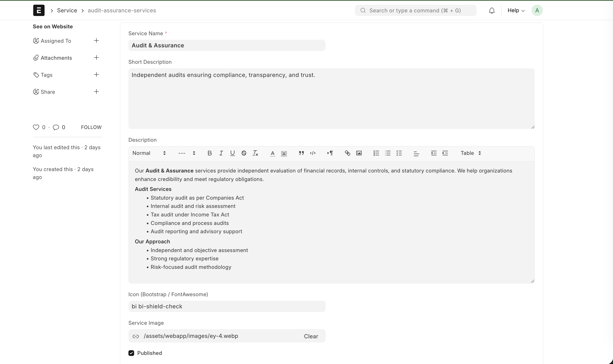
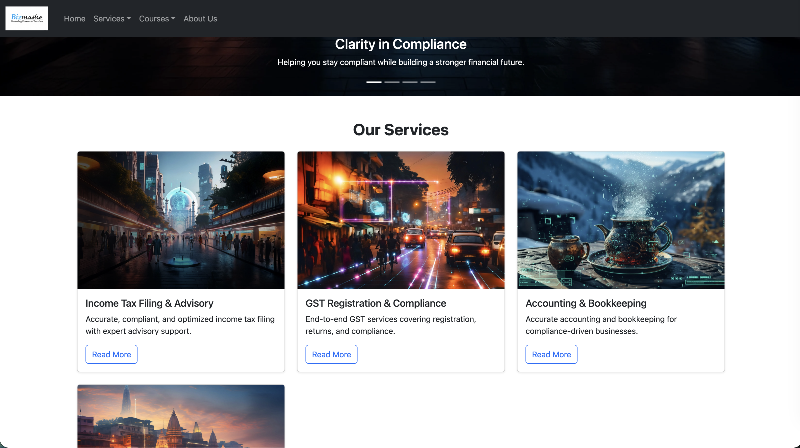

Generic Website Service Template
=============================================

Overview
--------
This directory contains a small website/service app that provides a generic,
reusable template for presenting services or offerings. The intent is to keep
layout, styles and templates separate from content so sites can customize the
display by updating Service documents or overriding templates.

Purpose
-------
- Provide a flexible service page template that can be adapted to many use cases.
- Demonstrate how to render Service-style documents into public pages.

Key Features
------------
- Service-driven pages: templates render fields from a Service document (title,
	short description, image, full description).
- Simple, overridable HTML templates under `templates/` for layout and markup.

Repository layout
-----------------
- [webapp](webapp): root of the app.
- [webapp/templates](webapp/templates): HTML templates and partials.
- [webapp/templates/generators/service.html](webapp/templates/generators/service.html): main service page template.

Customization guide
-------------------
1. Content: Create or update a Service document and populate `service_name`,
	 `short_description`, `service_image`, `route`, `Meta title`, `Meta Description` and `description`. The template will
	 render those fields automatically.
	 Follow below steps to create new service entry.

	1. Create new doc type called  `Service` with all required values.
	
	2. Once services docs are created which will be available on the home page with nice layout.
	
    

Development & common commands
-----------------------------
Start Frappe bench in development mode:

```
bench start
```

Clear cache for a specific site after changing templates or assets:

```
bench --site <site-name> clear-cache
```

Apply database migrations (if relevant):

```
bench migrate
```

Testing & CI
------------
- Follow the project or organization guidelines for CI. This app can be tested
	inside a standard Frappe bench instance.

Notes & best practices
----------------------
- Keep textual content in Service documents; avoid hard-coded copy in
	templates when possible.
- Use site-level template overrides for branding changes instead of editing
	the app templates directly.

Contributing
------------
Contributions are welcome. Please follow the repository's general contributing
guidelines. Add tests for behavior-affecting changes and keep documentation up
to date.

If you want this README expanded with examples, screenshots, or developer
instructions specific to your environment, tell me what to add and I will
update it.
